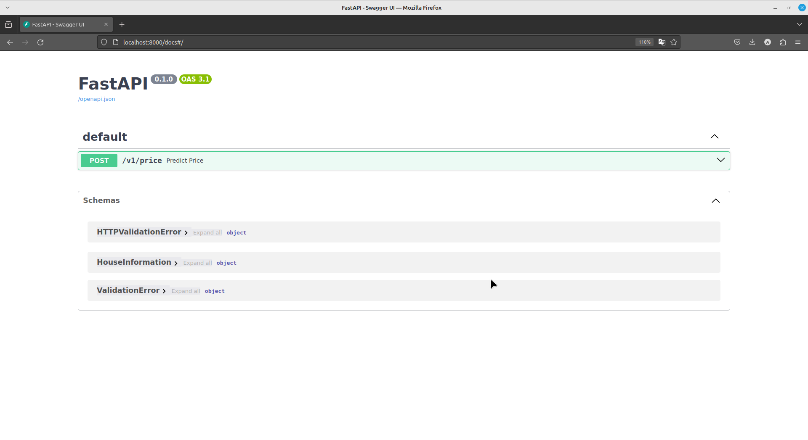

## How to run the project
1. Clone the repository
2. Build docker image
    ```
    docker build -t house-price-prediction .
    ```
3. Run docker container based on created image
    ```
    docker run -d --name house-price-prediction -d -p 8000:8000 house-price-prediction
    ```
4. Run Swagger UI for API documentation by enterng link below in the web browser
    ```
    http://localhost:8000/docs
    ```
    
